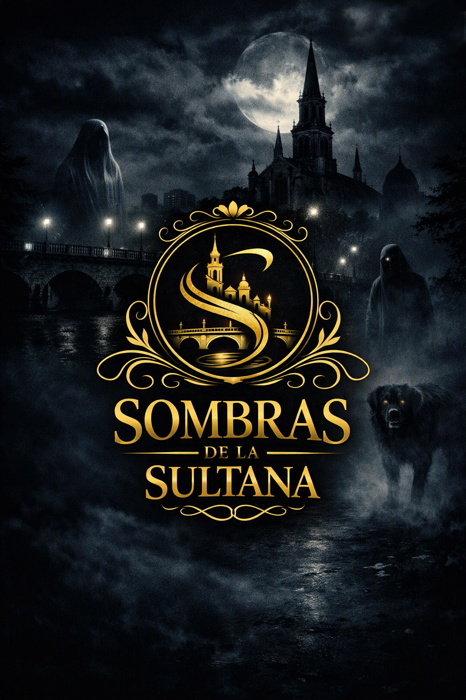

# Sombras de la Sultana



**Relatos de terror urbano inspirados en Cali, su historia y sus leyendas.**

Sombras de la Sultana es un proyecto narrativo que convierte lugares, personajes y
recuerdos de Cali en historias breves de misterio y terror. Cada episodio combina
leyenda urbana, memoria local y una atmósfera visual oscura.

<p align="center">
  
</p>

## Episodios

### 1. El caminante del Cementerio Central

En el Cementerio Central aparece una tumba sin nombre y un hombre vestido de negro
que llora frente a ella. Quien se queda escuchando puede llevarse ese lamento a casa.

[Leer el guion](Episodes/01%20-%20El%20caminante%20del%20cementerio%20Central/01%20Historia/01%20-%20El%20caminante%20del%20cementerio%20Central%20-%20Guion%20literario%20v2.md)

### 2. Tragedia del 7 de agosto

La tragedia de 1956 sigue respirando bajo las calles de Cali. Cerca de la cruz blanca,
un vigía espectral busca a quienes cargan con la culpa de aquella noche.

[Leer el guion](Episodes/02%20-%20Tragedia%20del%207%20de%20agosto/01%20Historia/02%20-%20Tragedia%20del%207%20de%20agosto.md)

### 3. La monja de San Francisco

Cuando termina la rumba en el centro, una monja recorre la Plazoleta de San Francisco.
Quien se pierde en la madrugada puede seguirla hasta una puerta del convento que no
existe durante el día.

[Leer el guion](Episodes/03%20-%20%20La%20monja%20de%20San%20Francisco/01%20Historia/03%20-%20La%20monja%20de%20San%20Francisco.md)

### 4. El perro de Joaquín de Caicedo y Cuero

Cada año, cerca del 25 de julio, una sombra canina da vueltas alrededor de la estatua
de la Plaza de Caicedo. El perro sigue esperando una respuesta de su antiguo amo.

[Leer el guion](Episodes/04%20-%20El%20perro%20de%20Joaquin%20de%20Caicedo%20y%20Cuero/01%20Historia/04%20-%20El%20perro%20de%20Joaquin%20de%20Caicedo%20y%20Cuero.md)

## Estado del proyecto

El primer episodio está en producción. Los cuatro relatos cuentan con materiales de
desarrollo y arte; el contenido y el avance de cada uno pueden consultarse en su
carpeta correspondiente dentro de [`Episodes/`](Episodes/).

## Organización

```text
Context/    Guías generales de dirección y producción.
Episodes/   Guion, storyboard, arte, audio y materiales de publicación por episodio.
Images/     Imágenes generales del proyecto, como el póster y el logo.
scripts/    Herramientas auxiliares de producción.
```
